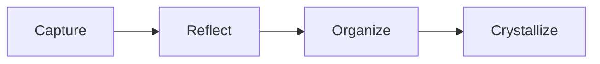

# Markdown Learning

Markdown is the plain-text language Grimoire stores on disk. You can read it anywhere, but Grimoire makes it feel like a real app.

## Headings

Use headings to shape a note.

```markdown
# Main title
## Section
### Smaller section
```

## Emphasis

Use **bold** for strong labels and *italic* for gentle emphasis.

```markdown
This is **important** and this is *subtle*.
```

## Lists

- Bullets are good for loose ideas.
- Numbered lists are good for steps.
- Task lists are good for decisions and follow-up.

```markdown
- A loose idea
1. A first step
- [ ] A task to finish
```

## Links

Use a wikilink when the target is another note in your vault.

```markdown
See [[grimoire-links-and-backlinks]].
```

Use a regular Markdown link for the web.

```markdown
[Markdown Guide](https://www.markdownguide.org/)
```

## Code and console snippets

Use inline code like `pnpm build`, or fenced blocks for longer examples.

```bash
pnpm dev --port 5201
```

## Diagrams, math, and tables

Grimoire can preview richer Markdown without hiding the source.



| Markdown feature | Why it matters |
| --- | --- |
| Tables | Compare project facts without a database. |
| Mermaid | Sketch systems as text. |
| Math | Keep technical notes portable. |

## Frontmatter

Frontmatter is the metadata block at the top of a note.

```yaml
---
type: Project
status: Active
belongs_to: "[[25q2]]"
---
```

Grimoire reads this metadata for filters, cards, properties, and project context.
