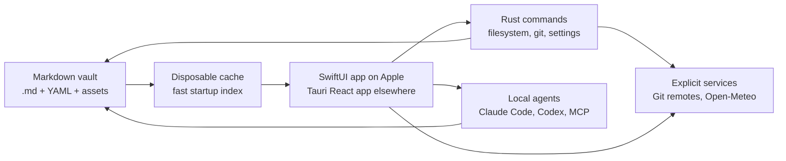
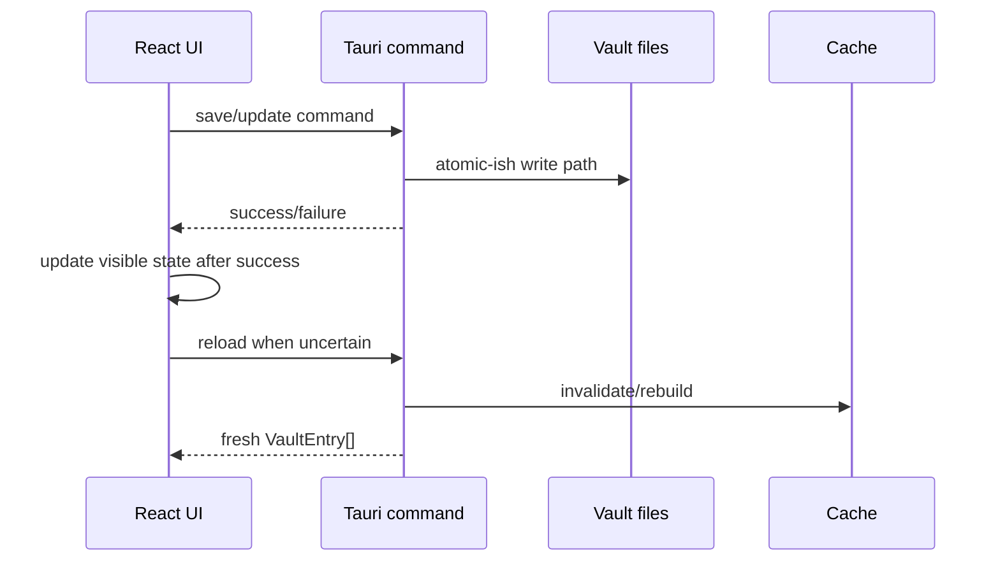
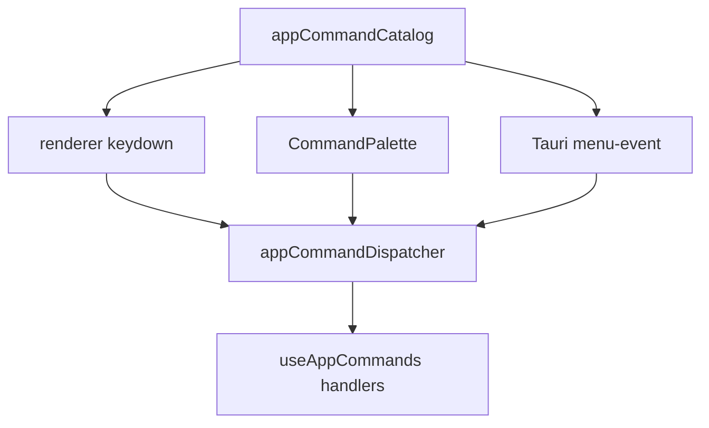

# Architecture

Grimoire is a local-first desktop app over a folder of markdown files. The product surface can feel like a journal, a Notion-style workspace, a graph explorer, or an AI memory system, but the architecture has one hard rule:

**The vault on disk is the authority.**

Everything else - cache, SwiftUI/React state, graph layout, search result, and agent context - is derived from files and can be rebuilt.

## Product Shape

Grimoire has five user-facing workspaces:

1. **Navigation**: sidebar filters, folders, types, favorites, archive, inbox, and changes.
2. **Selection**: note lists, saved views, search, Pulse history, and Neighborhood relationship browsing.
3. **Editing**: native SwiftUI editing on macOS/iOS, Tauri rich/raw markdown editing on non-Apple platforms, diff mode, wikilinks, math, code blocks, and frontmatter.
4. **Context**: Inspector, backlinks, relationship panels, instances, note metadata, Git history, graph, and weather snapshots.
5. **Agents**: local CLI agents through Claude Code / Codex adapters and MCP vault tooling.

## Runtime Layers

| Layer | Current implementation | Owns | Must not own |
|---|---|---|---|
| Apple shell | SwiftUI/AppKit | macOS and iOS UX, native text behavior, platform presentation | divergent vault semantics |
| Non-Apple shell | Tauri v2 | windows, menus, app packaging, IPC bridge | vault data model |
| Non-Apple frontend | React 19 + TypeScript | orchestration, editor UI, graph UI, settings panels | direct filesystem writes |
| Backend | Rust | filesystem, frontmatter writes, Git, settings, native windows | presentation state |
| Editor core | MarkdownEditor Swift package + Tauri adapters | shared markdown semantics and platform adapters | app-only vault workflows |
| Editor engines | SwiftUI editor surfaces, BlockNote, CodeMirror | rich editing and raw markdown editing | permanent document format |
| Agent layer | CLI adapters + MCP | local agent sessions and vault tools | hidden cloud storage |

The app is intentionally polyglot where a language is the right tool. Swift owns the macOS/iOS UX. Tauri keeps the non-Apple shell. Rust keeps filesystem and packaging boundaries. TypeScript keeps the non-Apple renderer composition and web-first UI experiments. Packaging must still feel like one product.

## Source Of Truth

### Filesystem

The vault contains markdown notes, assets, saved view definitions, type documents, and vault-local config. Notes remain useful in other editors.

### Cache

The cache is a startup accelerator. If it is deleted, Grimoire rescans the vault. Cache corruption is recoverable; vault corruption is not acceptable.

### React State

Renderer state is session state. It can be optimistic, but disk writes must either complete or roll back visible state.

## Persistence Rules

Store data in the vault when it describes the vault:

- note content
- type, status, icon, color, aliases
- relationships and wikilinks
- saved views and visible columns
- type display preferences
- vault AI guidance files

Store data in app settings when it describes this installation:

- window size and placement
- selected theme mode, theme preset, editor font
- UI language
- update channel
- agent preference
- telemetry consent
- machine-specific paths

## Frontend Composition

`src/App.tsx` remains the main orchestrator. It wires hooks and top-level modals, but feature logic should live in smaller modules:

- `hooks/useVaultLoader.ts`: loads entries, modified files, folders, views, history, and cache refreshes.
- `hooks/useAppCommands.ts`: bridges keyboard, command palette, and native menu events.
- `components/Editor.tsx`: editor shell that delegates rich/raw/diff modes.
- `components/SingleEditorView.tsx`: BlockNote rich editor behavior.
- `components/RawEditorView.tsx`: CodeMirror markdown source mode.
- `packages/MarkdownEditor`: Swift Package Manager library for reusable markdown editor semantics in the macOS/iOS SwiftUI apps, with a CLI bridge for Tauri parity work.
- `components/Inspector.tsx`: properties, relationships, instances, and note info.
- `components/GraphModal.tsx`: graph UI only.
- `utils/noteGraph.ts`: graph data derived from vault entries.
- `utils/graphDisplay.ts`: graph scope, caps, layout, edge filters, and display stats.
- `utils/weatherSnapshot.ts`: explicit journal weather markdown generation.
- `lib/appearance.ts`: theme preset and editor font contract.

Feature modules should expose small contracts. If a component grows because it is thinking and rendering, split the thinking into `utils/` or a hook.

## Backend Composition

Rust is split by responsibility:

- `vault/`: scanning, parsing, cache, rename, views, fixtures, and migration helpers.
- `frontmatter/`: safe frontmatter updates and property operations.
- `git/`: status, history, commit, push, pull, clone, and remote flows.
- `commands/`: Tauri command boundary grouped by domain.
- `settings.rs`: installation settings and sanitizers.
- `ai_agents.rs`, `claude_cli.rs`, `mcp.rs`: local agent and MCP integration.
- `menu.rs`: native menu structure and command IDs.

Backend commands must validate paths and never trust renderer-provided filesystem locations blindly.

## Command Routing

Keyboard shortcuts, command palette actions, Linux menu actions, and macOS native menu events share the same command catalog. This avoids the classic desktop-app failure where menu commands and renderer shortcuts drift apart.

Text editing shortcuts need special care on macOS. Browser-reserved shortcuts, native text bindings, IME composition, and WKWebView behavior should be treated as product requirements, not edge trivia.

## Editor Architecture

Markdown is the durable format. Editors are views over markdown.

- SwiftUI gives the macOS/iOS editor its native text, input, and platform integration surface.
- BlockNote gives the non-Apple Tauri editor rich editing, slash menu, tables, code blocks, math rendering, wikilinks, and media handling.
- CodeMirror gives the non-Apple Tauri editor raw source editing, YAML visibility, precise cursor control, and a better base for source-level features.
- `MarkdownEditor` owns editor-neutral markdown semantics for Apple-native surfaces: frontmatter splitting, wikilink round-tripping, math placeholder serialization, snippets, word counts, and compact markdown.
- App-local editor utilities preserve Grimoire-specific behavior across modes: arrow ligatures, image path portability, raw-mode sync, selection repair, and vault-aware adapters. Non-Apple Tauri surfaces keep matching adapters instead of importing Swift UI concerns.

Lessons from the local `.tmp` reference repos:

- Native text controls are worth considering for macOS when find/replace, undo, IME, and system bindings matter.
- A web editor inside WKWebView needs explicit contracts for mount, set document, flush, find, selection, and command application.
- The markdown source must remain authoritative even when the editor surface becomes richer.
- File watching and render/export pipelines should be shared rather than duplicated per surface.

## Graph Architecture

Graph data is derived at runtime:

- nodes come from `VaultEntry[]`
- relationship edges come from frontmatter relationship fields
- wikilink edges come from markdown body links
- graph search matches title and type, then keeps immediate neighbors
- graph display can scope to the active note neighborhood or the whole visible vault
- graph display can filter all edges, relationships only, or wikilinks only
- large graphs are capped before SVG rendering

The graph does not introduce a second database. If semantic search or embeddings arrive later, they should enrich graph discovery without replacing the file-backed graph.

## Appearance Runtime

Theme mode, theme preset, and editor font are resolved through `lib/appearance.ts`, mirrored to localStorage for flash-free startup, sanitized in Rust settings, and applied as root attributes:

- `data-theme`
- `data-theme-preset`
- `data-editor-font`

CSS variables define the semantic contract. New UI should consume semantic tokens, not hardcoded colors.

## AI And MCP

Grimoire favors local agents:

- Claude Code and Codex are detected from common shell/toolchain locations.
- The app streams agent output into `AiPanel`.
- MCP exposes vault tools so agents can inspect and operate on local notes.
- Agent choice is an app setting; vault guidance files live with the vault.

The design goal is not "AI writes notes for you." The goal is that an agent can understand the same durable knowledge structure the user already uses.

## External Integrations

Network work must be explicit or user-triggered:

- Git remotes are used for push, pull, clone, and history.
- Open-Meteo is called only when the user inserts a weather snapshot.
- Update checks follow the configured release channel.
- Telemetry obeys consent and must not include vault content, note titles, or paths.

## Platform-Native Direction

The app may use separate shells when that makes the product better. Apple platforms are SwiftUI-first. Non-Apple desktop platforms stay Tauri-first.

- SwiftUI/AppKit/UIKit shells for system-grade window, menu, focus, touch, and text behavior on macOS and iOS
- native find/replace, undo, IME, and text bindings where web editors fall short
- FSEvents-backed file watching
- QuickLook and export surfaces over the same markdown rendering pipeline
- platform-specific polish without platform-specific vault semantics

This is not a "one UI everywhere" product. A shell can be rebuilt from scratch for its platform. The rule is simple: share markdown, vault, and workflow semantics; let platform UX diverge when that improves correctness, speed, or feel.

## Quality Gates

- Keep code files under 400 lines where practical.
- New exported APIs need JSDoc.
- Prefer tests for behavior, not implementation shape.
- No unchecked `any`, broad disables, or silent command drift.
- CodeScene gates are a ratchet when available.
- Commits must be signed.
- Do not push until the current local functionality is actually worth preserving.
