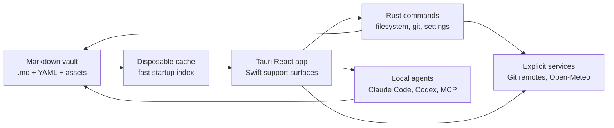
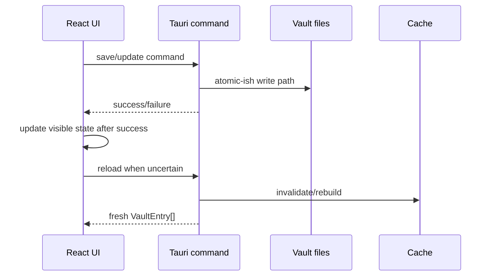
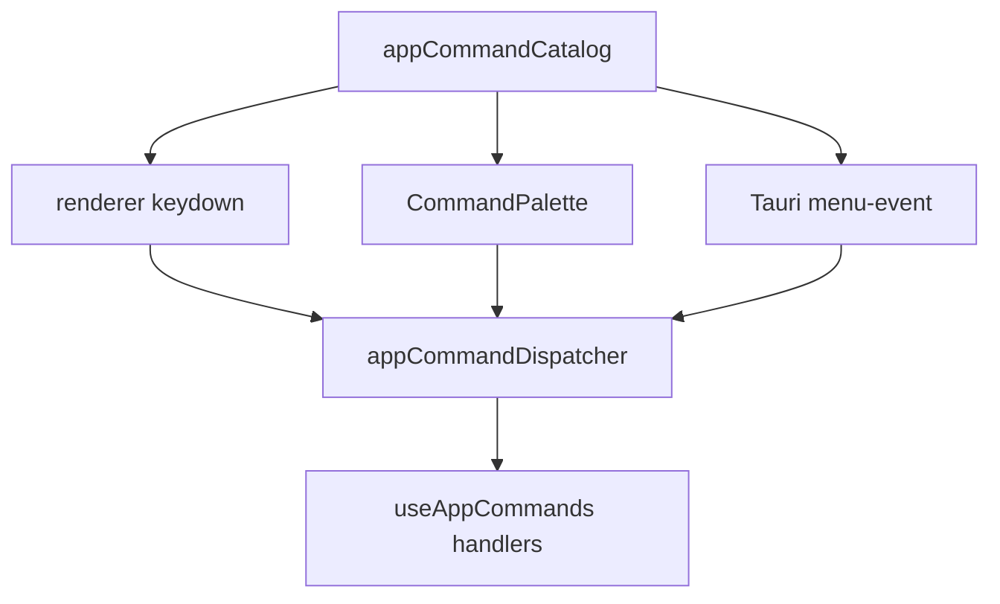

# Architecture

Grimoire is a local-first desktop app over a folder of markdown files. The product surface can feel like a journal, a Notion-style workspace, a graph explorer, or an AI memory system, but the architecture has one hard rule:

**The vault on disk is the authority.**

Everything else - cache, React/SwiftUI state, graph layout, search result, and agent context - is derived from files and can be rebuilt.

## Product Shape

Grimoire has six user-facing workspaces:

1. **Dashboard**: the default assistant board for quick capture, open loops, private journal/dream prompts, memory queue, recent notes, and visible local-first status.
2. **Navigation**: sidebar filters, folders, types, favorites, archive, inbox, and changes.
3. **Selection**: note lists, saved views, search, Pulse history, and Neighborhood relationship browsing.
4. **Editing**: Tauri rich/raw markdown editing as the primary product surface, SwiftUI/WebKit support surfaces where Apple-native integration is worth it, diff mode, Spelllinks (`[[note]]` wikilinks), math, code blocks, and frontmatter.
5. **Context**: Inspector, backlinks, relationship panels, instances, note metadata, Git history, graph, and weather snapshots.
6. **Agents**: local CLI agents through Claude Code / Codex adapters and MCP vault tooling.

## Runtime Layers

| Layer | Current implementation | Owns | Must not own |
|---|---|---|---|
| App shell | Tauri v2 | windows, menus, app packaging, IPC bridge, first mobile feasibility path | vault data model |
| Frontend | React 19 + TypeScript | orchestration, editor UI, graph UI, settings panels | direct filesystem writes |
| Apple support | SwiftUI/AppKit/UIKit/WebKit | packaging support, native bridges, parity prototypes, platform-only integrations | a second default editor product |
| Backend | Rust | filesystem, frontmatter writes, Git, settings, native windows | presentation state |
| Editor core | MarkdownEditor Swift package + `@grimoire/markdown-editor` + Tauri adapters | shared markdown semantics, slash-command primitives, and platform adapters | app-only vault workflows |
| Editor engines | BlockNote, CodeMirror, SwiftUI/WebKit support surfaces | rich editing, raw markdown editing, and native bridge experiments | permanent document format |
| Agent layer | CLI adapters + MCP | local agent sessions and vault tools | hidden cloud storage |

The app is intentionally polyglot where a language is the right tool. Tauri owns the primary product surface. Rust keeps filesystem and packaging boundaries. TypeScript keeps the editor, graph, and AI workflow composition. Swift stays available for Apple-native support work without becoming a duplicate editor roadmap.

## Source Of Truth

### Filesystem

The vault contains markdown notes, assets, saved view definitions, type documents, and vault-local config. Notes remain useful in other editors.

Vaults are local-first folders before they are Git repositories. Git-backed vaults enable history, Changes, Pulse, commits, pull/push, and conflict tooling; local-only vaults still open, scan, edit, and save normally. Git is an explicit per-vault capability in the local vault registry: a folder may contain `.git` metadata while Grimoire is still instructed to treat it as local-only, which disables status checks, commits, pulls, pushes, and AutoGit from the app.

New vault creation uses an in-app dialog to choose a local folder, iCloud Drive folder, Google Drive Desktop folder, another synced folder, or a custom filesystem path. The vault registry stores storage provider metadata separately from optional sync provider metadata.

### Cache

The cache is a startup accelerator. If it is deleted, Grimoire rescans the vault. Cache corruption is recoverable; vault corruption is not acceptable.

### React State

Renderer state is session state. It can be optimistic, but disk writes must either complete or roll back visible state.

## Persistence Rules

Store data in the vault when it describes the vault:

- note content
- type, status, icon, color, aliases
- relationships and Spelllinks
- saved views and visible columns
- type display preferences
- vault AI guidance files

Store data in app settings when it describes this installation:

- window size and placement
- selected theme mode, theme preset, editor font
- UI language
- menu bar icon visibility
- update channel
- agent preference
- telemetry consent
- machine-specific paths

## Frontend Composition

`src/App.tsx` remains the main orchestrator. It wires hooks and top-level modals, but feature logic should live in smaller modules:

- `hooks/useVaultLoader.ts`: loads entries, modified files, folders, views, history, and cache refreshes.
- `components/dashboard/VaultDashboard.tsx`: default vault assistant board for capture, local-first privacy signals, open loops, daily prompts, and recent-note re-entry.
- `hooks/useDashboardCapture.ts` and `utils/dashboardCapture.ts`: slash-routed capture creation for notes, journals, dreams, tasks, memory, and `/ask` agent prompts without requiring Git.
- `hooks/useAppCommands.ts`: bridges keyboard, command palette, and native menu events.
- `hooks/useLayoutPanels.ts`: owns default sidebar, note-list, and inspector widths. It keeps wide monitors on the full layout while narrower laptop viewports start with editor-safe navigation widths and a collapsed inspector.
- `hooks/useSidebarColumnCollapse.ts`: persists the app-local compact sidebar rail preference outside the vault.
- `components/sidebar/SidebarRail.tsx`: collapsed left-column navigation rail for Inbox, All Notes, Archive, and returning to the full sidebar.
- `components/Editor.tsx` and `components/EditorLayout.tsx`: editor shell that delegates rich/raw/diff modes and the right-side inspector/AI shell.
- `components/EditorAgentComposerBar.tsx`, `components/EditorNavigatorPopover.tsx`, and `utils/noteNavigation.ts`: editor-adjacent composer affordance plus local search and table-of-contents navigation over the active Markdown note.
- `components/EditorLoadingState.tsx`: default centered animated SVG loader for lazy editor startup and note-switch transitions.
- `components/SingleEditorView.tsx`: BlockNote rich editor behavior that imports the reusable slash-command package.
- `markdown-editor/packages/js`: React/BlockNote package for the slash command catalog, command filtering metadata, date helpers, templates, markdown-safe insertion helpers, and host-schema fallbacks.
- `components/RawEditorView.tsx`: CodeMirror markdown source mode with raw find/replace and wikilink autocomplete.
- `markdown-editor/packages/swift`: Swift Package Manager library for reusable markdown editor semantics plus `MarkdownEditorUI` native SwiftUI and WebKit support surfaces, with a CLI bridge for Tauri parity work.
- `utils/markdownSemanticsAdapter.ts`: Tauri adapter facade that mirrors the Swift package semantics.
- `components/Inspector.tsx`: properties, relationships, instances, and note info.
- `components/ConstellationInsightsPanel.tsx`: local heuristic insight surface in the Inspector. It derives summaries, key points, linked concepts, and recent activity from `VaultEntry` and current note content; it does not imply remote inference.
- `utils/propertySuggestions.ts`: property-panel quick-add definitions and property-name-to-input-type inference.
- `components/StatusBar.tsx` and `components/status-bar/*`: bottom-bar vault, sync, AI, settings, and presence-tone controls.
- `components/CreateVaultDialog.tsx`: local-first vault creation surface for local and cloud-synced filesystem targets.
- `components/GraphModal.tsx` and `components/GraphControlPanel.tsx`: graph UI, scope controls, edge filters, and type visibility toggles.
- `utils/noteGraph.ts`: graph data derived from vault entries.
- `utils/graphDisplay.ts`: graph scope, caps, layout, edge/type filters, and display stats.
- `utils/weatherSnapshot.ts`: explicit journal weather markdown generation.
- `utils/audioTranscription.ts` and `hooks/useAudioTranscription.ts`: local-first audio picker, transcript note creation, and command-palette orchestration.
- `utils/markdownFolderImport.ts`: settings-triggered folder, Bear/TextBundle, Markdown ZIP, Day One, and Journey import pickers plus result feedback.
- `utils/vaultExport.ts`: settings-triggered Markdown ZIP export target picking, native command call, and result feedback.
- `lib/appearance.ts`: theme preset and editor font contract.

Feature modules should expose small contracts. If a component grows because it is thinking and rendering, split the thinking into `utils/` or a hook.

## Backend Composition

Rust is split by responsibility:

- `vault/`: scanning, parsing, cache, rename, views, fixtures, and migration helpers.
- `vault/importer.rs`: safe Markdown folder importer that copies notes/assets into `imports/<source>/` and writes a visible import report.
- `vault/journal_importer.rs`: Day One/Journey JSON or ZIP importer that writes dated Markdown journal notes plus attachments.
- `vault/zip_importer.rs`: safe Markdown ZIP extraction before handing files to the shared Markdown folder importer.
- `vault/exporter.rs`: portable Markdown ZIP export that refuses to write inside the active vault.
- `frontmatter/`: safe frontmatter updates and property operations.
- `git/`: status, history, commit, push, pull, clone, and remote flows.
- `commands/`: Tauri command boundary grouped by domain.
- `settings.rs`: installation settings and sanitizers.
- `transcription.rs`: local Whisper command execution and transcript parsing.
- `ai_agents.rs`, `claude_cli.rs`, `mcp.rs`: local agent and MCP integration.
- `menu.rs`: native menu structure and command IDs.
- `menu_bar.rs`: optional native menu bar icon lifecycle and quick-action menu.

Backend commands must validate paths and never trust renderer-provided filesystem locations blindly.

## Command Routing

Keyboard shortcuts, command palette actions, Linux menu actions, macOS native menu events, and menu bar quick actions share the same command catalog. This avoids the classic desktop-app failure where menu commands and renderer shortcuts drift apart.

Text editing shortcuts need special care on macOS. Browser-reserved shortcuts, native text bindings, IME composition, and WKWebView behavior should be treated as product requirements, not edge trivia.

## Editor Architecture

Markdown is the durable format. Editors are views over markdown.

- BlockNote gives the Tauri editor rich editing, slash menu, tables, code blocks, math rendering, Spelllinks, and media handling.
- CodeMirror gives the Tauri editor raw source editing, YAML visibility, precise cursor control, and a better base for source-level features.
- `@grimoire/markdown-editor` owns the primary React/BlockNote editor package: slash commands, command aliases, Mem/Bear/Obsidian/Notion-inspired insertion UX, reusable templates, host-schema fallbacks, canvas attachment placeholders, and shared custom math block type constants.
- `MarkdownEditor` owns editor-neutral markdown semantics for Apple support surfaces: frontmatter splitting, wikilink round-tripping, math placeholder serialization, snippets, word counts, and compact markdown.
- Canvas and handwriting surfaces are attachment-backed: Markdown stores a preview image plus a `grimoire-canvas` fence. The Tauri surface edits pointer-event strokes and saves source JSON plus a PNG preview through `save_note_content` and `save_canvas_preview`; Apple PencilKit can keep the same source file contract.
- Audio transcription is also Markdown-first: the command palette opens an audio picker, native Rust runs a local Whisper CLI, and the renderer saves a `Transcript` note with source-audio metadata plus timestamped Markdown.
- Spanda-style practice workflows are Markdown-first: practice sessions, panchanga snapshots, japa/pranayama logs, and practice prescriptions insert durable tables/sections rather than importing Spanda's app database into the vault.
- Grimoire app code supplies vault context around that package: `[[` note links, `@` person mentions, `#` tag/collection autocomplete, file picking, weather, and future AI transform callbacks.
- App-local editor utilities preserve Grimoire-specific behavior across modes: arrow ligatures, image path portability, raw-mode sync, selection repair, and vault-aware adapters. Tauri surfaces keep matching adapters instead of importing Swift UI concerns.
- Slash commands are editor-level commands. Shared intent is documented in `docs/MARKDOWN-SEMANTICS-CONTRACT.md`; implementation can be shell-specific as long as the saved markdown result is portable.
- Type icons can be Phosphor names, emoji, remote image URLs, Tauri asset URLs, or `data:image/*` badges. Renderers must fit image icons into the requested icon box instead of assuming a square source.

Lessons from the local `.tmp` reference repos:

- Native text controls are worth considering for macOS when find/replace, undo, IME, and system bindings matter.
- A web editor inside WKWebView needs explicit contracts for mount, set document, flush, find, selection, and command application.
- The markdown source must remain authoritative even when the editor surface becomes richer.
- File watching and render/export pipelines should be shared rather than duplicated per surface.

## Graph Architecture

Graph data is derived at runtime:

- nodes come from `VaultEntry[]`
- relationship edges come from frontmatter relationship fields
- wikilink edges come from markdown body links
- graph search matches title and type, then keeps immediate neighbors
- graph display can scope to the active note neighborhood or the whole visible vault
- graph display can filter all edges, relationships only, or Spelllinks only
- large graphs are capped before SVG rendering

The graph does not introduce a second database. If semantic search or embeddings arrive later, they should enrich graph discovery without replacing the file-backed graph.

## Appearance Runtime

Theme mode, theme preset, and editor font are resolved through `lib/appearance.ts`, mirrored to localStorage for flash-free startup, sanitized in Rust settings, and applied as root attributes:

- `data-theme`
- `data-theme-preset`
- `data-editor-font`

`lib/fontConfig.ts` resolves the font role contract (`ui`, `editor`, `mono`, `display`, `label`) and loads bundled font assets from `assets/fonts` through `FontFace` when needed. Theme preset metadata comes from `src/themes/presets.json`, is validated against `themePresetIds.ts`, and hot-reloads in Vite for Settings previews. CSS variables define the semantic contract. New UI should consume semantic tokens, not hardcoded colors or direct font-family literals.

Sidebar artwork and flagship system themes are theme-aware CSS loaded after the base sidebar appearance layer. The flagship presets own the whole shell contract: sidebar, collapsed rail, note-list path ribbons, editor canvas, inspector, AI panel, dashboard cards, settings previews, and reduced-motion-safe animation timing.

## AI And MCP

Grimoire favors local agents:

- Claude Code and Codex are detected from common shell/toolchain locations.
- The app streams agent output into `AiPanel`.
- MCP exposes vault tools so agents can inspect and operate on local notes.
- MCP also exposes project-intelligence tools for project docs, durable `BOARD.md` tasks, and wikilink graph edges.
- MCP vault and project read tools pass through the Locality Firewall before returning note content, search results, recent context, project docs, tasks, or graph nodes.
- Memory Ledger records are Markdown notes (`type: Memory`) with source, confidence, last-seen, expiry, contradiction, and locality metadata.
- Crystallize writes start as reviewed local Markdown memory notes under `memory/crystallized/`; richer note/frontmatter/task diffs must stay review-first.
- Generated project board rows keep stable `grimoire-task` comments with priority/source metadata so app scans and MCP tools share one task contract.
- Agent choice and per-agent CLI model overrides are app settings; vault guidance files live with the vault.
- Import, export, storage, and second-brain readiness are surfaced from the shared portability registry so settings, docs, and agents describe the same capability map.

The design goal is not "AI writes notes for you." The goal is that an agent can understand the same durable knowledge structure the user already uses.

## External Integrations

Network work must be explicit or user-triggered:

- Git remotes are used for push, pull, clone, and history.
- Open-Meteo is called only when the user inserts a weather snapshot.
- Update checks follow the configured release channel.
- Telemetry obeys consent and must not include vault content, note titles, or paths.

## Release Artifacts

Tauri bundle output under `src-tauri/target` is generated state, not release truth.
Before local macOS packaging, `scripts/clean-tauri-bundles.mjs` removes stale
bundle directories so old updater tarballs or DMGs cannot sit beside a fresh app.

`scripts/verify-release-artifacts.mjs` is the release-artifact guard: it compares
the app icon inside exploded `.app` bundles, updater `.app.tar.gz` files, and DMGs
against `src-tauri/icons/icon.icns`, and can require `codesign --verify` for
packaged apps. The GitHub release workflow runs this after producing signed
macOS artifacts for both Apple Silicon and Intel targets.

## Platform Direction

The app is Tauri-first for the editor product surface. Swift remains a support layer for Apple-native integrations and a fallback if a named WebView limitation blocks product quality.

- Tauri + React owns the main editor, graph/wiki, slash command, AI workflow, and settings surfaces.
- SwiftUI/AppKit/UIKit/WebKit can host share sheets, document providers, QuickLook, widgets, Shortcuts, App Store packaging, and targeted native editor experiments.
- Native find/replace, undo, IME, or text bindings can justify Swift work only when the Tauri editor cannot meet the requirement.
- Platform-specific polish must not create platform-specific vault semantics.

This is not a "two full apps by default" product. The rule is simple: ship one excellent editor first; use native code where it materially improves the product.

## Quality Gates

- Keep code files under 400 lines where practical.
- New exported APIs need JSDoc.
- Prefer tests for behavior, not implementation shape.
- No unchecked `any`, broad disables, or silent command drift.
- CodeScene gates are a ratchet when available.
- Commits must be signed.
- Do not push until the current local functionality is actually worth preserving.
