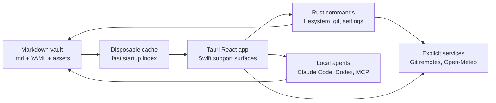
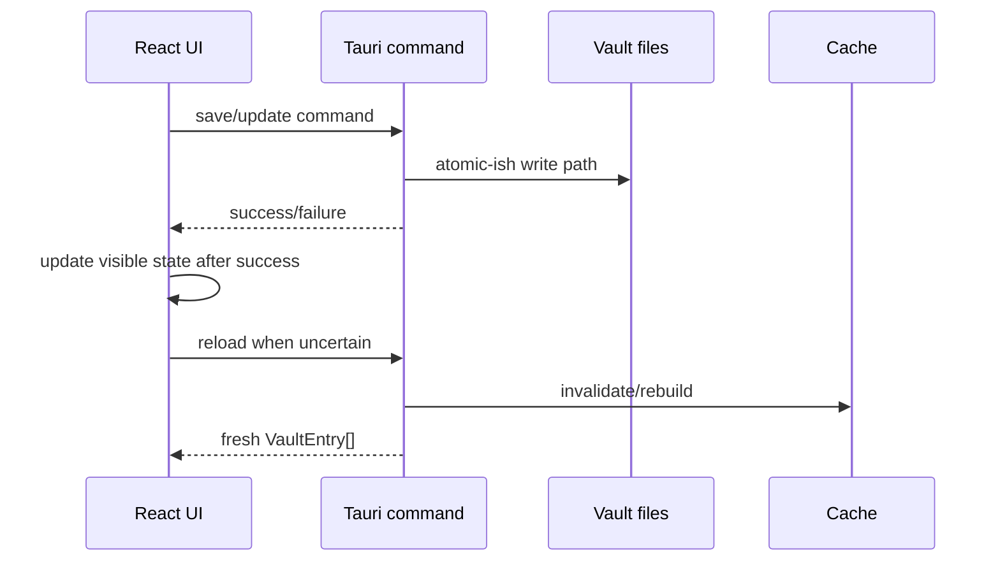
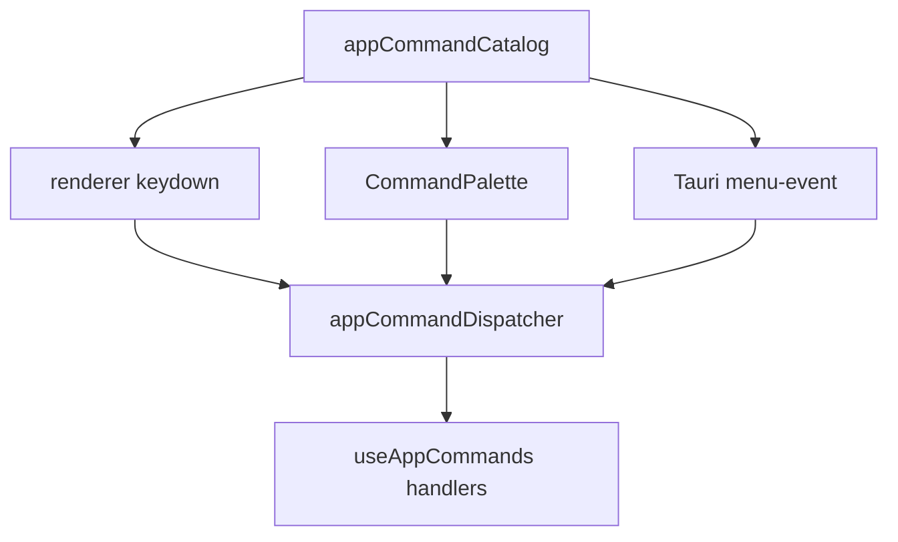

# Architecture

Grimoire is a local-first desktop app over a folder of markdown files. The product surface can feel like a journal, a Notion-style workspace, a graph explorer, or an AI memory system, but the architecture has one hard rule:

**The vault on disk is the authority.**

Everything else - cache, React/SwiftUI state, graph layout, search result, and agent context - is derived from files and can be rebuilt.

## Product Shape

Grimoire has six user-facing workspaces:

1. **Dashboard**: the default assistant board for quick capture, open loops, Daily Thread guidance, Time Loom, private journal/dream prompts, memory queue, reviewed Crystallize loop state, recent vault-context notes, and visible local-first status.
2. **Navigation**: sidebar filters, folders, types, favorites, archive, inbox, and changes.
3. **Selection**: note lists, saved views, search, Pulse history, and Neighborhood relationship browsing.
4. **Editing**: Tauri rich/raw markdown editing as the primary product surface, SwiftUI/WebKit support surfaces where Apple-native integration is worth it, diff mode, Spelllinks (`[[note]]` wikilinks), math, code blocks, and frontmatter.
5. **Context**: Inspector, backlinks, relationship panels, instances, note metadata, Git history, graph, and weather snapshots.
6. **Agents**: local CLI agents through Claude Code / Codex adapters and MCP vault tooling.

## Runtime Layers

| Layer | Current implementation | Owns | Must not own |
|---|---|---|---|
| App shell | Tauri v2 | windows, menus, app packaging, IPC bridge, first mobile feasibility path | vault data model |
| Frontend | React 19 + TypeScript | orchestration, editor UI, graph UI, settings panels | direct filesystem writes |
| Apple support | SwiftUI/AppKit/UIKit/WebKit | packaging support, native bridges, parity prototypes, platform-only integrations | a second default editor product |
| Backend | Rust | filesystem, frontmatter writes, Git, settings, native windows | presentation state |
| Editor core | MarkdownEditor Swift package + `@grimoire/markdown-editor` + Tauri adapters | shared markdown semantics, slash-command primitives, and platform adapters | app-only vault workflows |
| Editor engines | BlockNote, CodeMirror, SwiftUI/WebKit support surfaces | rich editing, raw markdown editing, and native bridge experiments | permanent document format |
| Agent layer | CLI adapters + MCP | local agent sessions and vault tools | hidden cloud storage |

The app is intentionally polyglot where a language is the right tool. Tauri owns the primary product surface. Rust keeps filesystem and packaging boundaries. TypeScript keeps the editor, graph, and AI workflow composition. Swift stays available for Apple-native support work without becoming a duplicate editor roadmap.

## Source Of Truth

### Filesystem

The vault contains markdown notes, assets, saved view definitions, type documents, and vault-local config. Notes remain useful in other editors.

Vaults are local-first folders before they are Git repositories. Git-backed vaults enable history, Changes, Pulse, commits, pull/push, and conflict tooling; local-only vaults still open, scan, edit, and save normally. Git is an explicit per-vault capability in the local vault registry: a folder may contain `.git` metadata while Grimoire is still instructed to treat it as local-only, which disables status checks, commits, pulls, pushes, and AutoGit from the app.

New vault creation uses an in-app dialog to choose a local folder, iCloud Drive folder, Google Drive Desktop folder, another synced folder, or a custom filesystem path. The vault registry stores storage provider metadata separately from optional sync provider metadata.

### Cache

The cache is a startup accelerator. If it is deleted, Grimoire rescans the vault. Cache corruption is recoverable; vault corruption is not acceptable.

### React State

Renderer state is session state. It can be optimistic, but disk writes must either complete or roll back visible state.

## Persistence Rules

Store data in the vault when it describes the vault:

- note content
- type, status, icon, color, aliases
- relationships and Spelllinks
- saved views and visible columns
- type display preferences
- vault AI guidance files

Store data in app settings when it describes this installation:

- window size and placement
- selected theme mode, theme preset, editor font
- UI language
- menu bar icon visibility
- update channel
- agent preference
- telemetry consent
- machine-specific paths

## Frontend Composition

`src/App.tsx` remains the main orchestrator. It wires hooks and top-level modals, but feature logic should live in smaller modules:

- `hooks/useVaultLoader.ts`: loads entries, modified files, folders, views, history, and cache refreshes.
- `components/CreateVaultDialog.tsx` and `utils/vaultCreation.ts`: local-first vault creation UI and path planning. The dialog previews template, storage, Git state, privacy, and local folder path before creating anything; desktop sync providers are treated as local folders, not credential-backed cloud accounts.
- `components/dashboard/VaultDashboard.tsx`: default vault assistant board for capture, local-first privacy signals, open loops, Daily Thread guidance, Time Loom, daily prompts, and reviewed Crystallize state.
- `lib/timeLoom.ts`, `lib/timeLoomPatterns.ts`, `lib/timeLoomGuidance.ts`, `components/dashboard/DailyThreadRail.tsx`, and `components/dashboard/TimeLoomPanel.tsx`: metadata-only temporal graph preview and next-action rail for Markdown activity, Dream Forge rhythm counts, mobile captures, voice notes, commits, scheduled calendar/event frontmatter, and Task/Todo due frontmatter. The builders return counts/date placement/patterns/actions only, never note bodies, protected titles, paths, project labels, raw due-key names, commit messages, device/source values, audio filenames, or provider names. Calm Daily Thread Crystallize actions seed the existing `/ask` and dashboard ask-context preview path with a source-safe, review-before-write memory proposal prompt plus a typed handoff intent instead of writing memory directly.
- `components/dashboard/DashboardRecentNotesPanel.tsx`: source-safe recent-note re-entry that shows vault-context notes or a protected-held count without exposing private/local-only titles.
- `lib/attentionMode.ts` and `components/dashboard/VaultDashboard.tsx`: local next-action priority model for conflicts, memory review, pending mobile capture review, unresolved open-loop drift, active-note drift, recent context-switch drift, private-lane freshness, pending local changes, reviewed Crystallize memory, and source-safe Crystallize prompts for calm recent threads.
- `lib/dreamForge.ts` and `components/dashboard/DreamForgePanel.tsx`: local-only Dream and Journal metadata summary for protected counts, symbols, emotional weather, and recurring people without body reads or cloud calls.
- `lib/mobileCaptureDraft.ts`, `lib/mobileCaptureDraft.fixture.json`, `lib/mobileCaptureMetadata.ts`, and `utils/dashboardModel.ts`: iPhone/iPad capture contract that turns quick-capture, share, voice, camera, transcript, and Pencil input into review-pending vault-relative Markdown with neutral non-body-derived titles/paths, a V1 schema marker, stable capture IDs, local-only frontmatter, Files-provider storage hints, local attachment manifests, blocked-until-review agent/export/sync context, and a visible Markdown review checklist, then exposes review state to the dashboard as metadata-only counts/actions through privacy-safe review queue items rather than full note records. Review outcomes graduate accepted/merged/moved/discarded captures out of the queue and keep blocked captures visible without leaking private note or device metadata. The fixture is the TypeScript/Swift parity seed for the future native companion.
- `components/AiPanelIntelligenceRail.tsx`: AI-panel intelligence surfaces above the chat stream. It owns the Agent Council strip, Context Capsule preview/dialog, Crystallize loop card, and Red-Team preview dialog so `AiPanel.tsx` stays focused on controller wiring, message history, composer, and the actual Crystallize write path. Agent Council rendering includes a source-safe current-pass brief, inspectable evidence rows for lane inputs, plus a workflow rail for intake, Council pass, synthesis, and review state. Source-safe Council synthesis packets can ask `AiPanel.tsx` to open the Crystallize review dialog as an `Agent Council` Memory source with safe Council labels preserved; protected packets stay policy-only and do not write. The review dialog itself owns the source-safe runway for sources, Locality Firewall state, editable diff size, and local Markdown landing before apply.
- `lib/redTeamPlan.ts`, `lib/redTeamPatchPlan.ts`, `components/RedTeamPlanCard.tsx`, and `components/RedTeamPlanDialog.tsx`: local AI-panel critique of the active note/plan across product, code, execution, UX, privacy, and evidence without remote calls, writes, or protected title/path/excerpt leaks.
- `lib/askContextPackage.ts`, `lib/providerPromptPrivacy.ts`, `hooks/useDashboardCapture.ts`, `utils/dashboardCapture.ts`, and `components/dashboard/DashboardAskContextPreview.tsx`: slash-routed capture creation for notes, journals, dreams, tasks, memory, and `/ask` agent prompts without requiring Git. Dashboard-originated asks build one source-safe package for public references. Daily Thread Crystallize asks add a structured `crystallize-memory` intent to the preview, queued prompt, Context Capsule/Council package, and provider prompt, while protected notes and protected Memory records can be counted in the user-facing preview only. The submitted handoff package and provider-bound prompt carry listed public references plus a stable Locality Firewall policy line, not protected counts or labels.
- `hooks/useAppCommands.ts`: bridges keyboard, command palette, and native menu events.
- `hooks/useLayoutPanels.ts`: owns default sidebar, note-list, and inspector widths. It keeps wide monitors on the full layout while narrower laptop viewports start with editor-safe navigation widths and a collapsed inspector.
- `hooks/useSidebarColumnCollapse.ts`: persists the app-local compact sidebar rail preference outside the vault.
- `components/sidebar/SidebarRail.tsx`: collapsed left-column navigation rail for Inbox, All Notes, Archive, and returning to the full sidebar.
- `components/AppLazySurfaces.tsx`: delayed surface boundary for heavyweight dialogs, palettes, Settings, graph/Pulse routes, onboarding, and the bottom status rail. The status rail keeps a stable local-only fallback so startup can paint before its menu and badge dependencies load.
- `components/LazyNoteList.tsx`: delayed boundary for the virtualized note-list route. Dashboard-first startup does not import `NoteList`, `react-virtuoso`, project workspace chrome CSS, or note-list relationship views until the user opens a note-list selection.
- `components/sidebar/SortableTypesSection.tsx`, `components/sidebar/FavoritesSortableList.tsx`, `components/note-list/ListPropertiesPopover.tsx`, and `components/note-list/ListPropertiesSortableOptions.tsx`: lazy customization/sortable surfaces that keep property editing and DnD libraries off the startup path while preserving immediate static lists as fallbacks.
- `utils/noteListHelpers.ts`, `utils/noteListSorting.ts`, and `utils/noteRelationships.ts`: split note-list filtering, sorting/persistence, and entity relationship/backlink graph building. Entity relationship graph work is dynamically imported only for entity views so normal note-list startup does not pay for wikilink relationship resolution.
- `components/note-list/EntityView.tsx`: lazy entity-only note-list rendering for pinned entity cards and relationship sections so normal note lists do not load pinned-card or relationship sort controls.
- `lib/i18nCore.ts`, `lib/i18nCommands.ts`, and `lib/i18nNoteList.ts`: startup-safe locale, command, and note-list copy. Supported UI locales are English, Simplified Chinese, German, Hindi, and Sanskrit, with English fallback for partial translations. Full Settings, appearance, and portability translations stay in the lazy Settings boundary so note-first startup does not import every provider/import/export label.
- `components/Editor.tsx` and `components/EditorLayout.tsx`: editor shell that delegates rich/raw/diff modes and the right-side inspector/AI shell.
- `components/EditorRightPanel.tsx` and `components/AiChatRightPanel.tsx`: right-side context shell. The parent keeps the AI controller alive so queued prompts and chat history survive panel toggles, while the full chat/Markdown AI surface lazy-loads only when the AI panel is opened.
- `components/EditorAgentComposerBar.tsx`, `components/EditorNavigatorPopover.tsx`, and `utils/noteNavigation.ts`: editor-adjacent composer affordance plus local search and table-of-contents navigation over the active Markdown note.
- `components/EditorLoadingState.tsx`: default centered animated SVG loader for lazy editor startup and note-switch transitions.
- `components/SingleEditorView.tsx`: BlockNote rich editor behavior that imports the reusable slash-command package.
- `markdown-editor/packages/js`: React/BlockNote package for the slash command catalog, command filtering metadata, date helpers, templates, markdown-safe insertion helpers, and host-schema fallbacks.
- `components/RawEditorView.tsx`: CodeMirror markdown source mode with raw find/replace and wikilink autocomplete.
- `markdown-editor/packages/swift`: Swift Package Manager library for reusable markdown editor semantics plus `MarkdownEditorUI` native SwiftUI and WebKit support surfaces, with a CLI bridge for Tauri parity work.
- `utils/markdownSemanticsAdapter.ts`: Tauri adapter facade that mirrors the Swift package semantics.
- `components/Inspector.tsx`: properties, relationships, instances, and note info.
- `components/ConstellationInsightsPanel.tsx`: local heuristic insight surface in the Inspector. It derives summaries, key points, linked concepts, and recent activity from `VaultEntry` and current note content; it does not imply remote inference.
- `utils/propertySuggestions.ts`: property-panel quick-add definitions and property-name-to-input-type inference.
- `components/StatusBar.tsx` and `components/status-bar/*`: bottom-bar vault, sync, AI, settings, and presence-tone controls.
- `components/CreateVaultDialog.tsx`: local-first vault creation surface for local and cloud-synced filesystem targets.
- `components/GraphModal.tsx`, `components/GraphCanvas.tsx`, and `components/GraphAgentPackagePanel.tsx`: graph UI, scope controls, edge filters, type visibility toggles, and source-safe agent package state. Package facts carry ready/guarded/blocked attributes so the theme layer can keep source-safe and local-held states visually consistent.
- `utils/noteGraph.ts`: graph data derived from vault entries.
- `utils/graphDisplay.ts`: graph scope, caps, layout, edge/type filters, and display stats.
- `utils/markdownBlock.ts` and `utils/weatherSnapshot.ts`: startup-safe Markdown block appending plus explicit journal weather Markdown generation. Open-Meteo parsing/network code stays behind the lazy Weather dialog.
- `utils/audioRecording.ts`, `utils/audioTranscription.ts`, `lib/transcriptionProviderConfig.ts`, `lib/transcriptionProviders.ts`, and `hooks/useAudioTranscription.ts`: local-first in-app recording, audio picker, transcript note creation, and command-palette orchestration. The hot path uses the tiny provider-config module for settings/default labels; picker/native transcription/note-write implementation and transcript Markdown builders lazy-load on explicit transcribe intent.
- `utils/markdownFolderImport.ts`: settings-triggered Markdown folder/Bear/ZIP/journal/Obsidian/Notion/Spanda import preview, Markdown folder/ZIP, Bear/TextBundle, Apple Journal, Day One, Journey, Obsidian, Notion, and Spanda import pickers plus result feedback.
- `hooks/useVaultPortabilityActions.ts`, `hooks/useObjectStoragePortabilityActions.ts`, and `components/ImportAutopsyTimeline.tsx`: keep the latest no-write import preview in React memory, keep storage preview state isolated from import/export actions, and render compact Settings proof surfaces with shortened local paths.
- `utils/vaultExport.ts` and `utils/portabilityCapsuleImport.ts`: settings-triggered Markdown ZIP/static HTML/JSON capsule/SQLite capsule export target picking, capsule import file picking, native command calls, reviewed capsule previews, and result feedback.
- `utils/objectStorageSync.ts`, `utils/objectStorageProviderSync.ts`, `utils/objectStorageLivePreflight.ts`, `utils/desktopStorageHealth.ts`, `components/DesktopStorageHealthPanel.tsx`, and `components/ObjectStoragePrototypeActions.tsx`: Settings-triggered storage proof plus local-mirror and provider command helpers. iCloud/GDrive Desktop health checks prove only local path/readability and never read provider credentials. Settings separates S3/Azure local-mirror fixtures from explicit S3/Azure provider push/pull preview/apply lanes. Provider apply uses the exact target args stored with the matching preview signature. Preflights use transient provider scope fields and local machine credential chains, returning only redacted reachability status.
- `lib/objectStorageAdapterDesign.ts`: design contract for S3/Azure sync adapters. It keeps object storage local-working-copy based, preview/apply only, credential-local, and protected by the same local-only policy as export.
- `lib/appearance.ts`: theme preset and editor font contract.
- `lib/tauriRuntime.ts`: lazy Tauri API bridge for native commands, channels, and current-window actions. Startup modules should import this bridge instead of statically importing `@tauri-apps/*` packages.

Feature modules should expose small contracts. If a component grows because it is thinking and rendering, split the thinking into `utils/` or a hook.

## Backend Composition

Rust is split by responsibility:

- `vault/`: scanning, parsing, cache, rename, views, fixtures, and migration helpers.
- `vault/importer.rs`: safe Markdown folder preview/importer that counts planned notes/assets/skips before writing, skips hidden local config/cert/mockup lanes, then copies notes/assets into `imports/<source>/` and writes a visible local-only import report.
- `vault/journal_importer.rs`, `vault/journal_importer_preview.rs`, and `vault/journal_html_import_helpers.rs`: Apple Journal, Day One, and Journey ZIP/HTML/JSON importers with no-write previews, dated Markdown journal notes, copied attachments, and local-only import reports.
- `vault/app_importer.rs`, `vault/app_importer_preview.rs`, `vault/app_importer_io.rs`, and `vault/spanda_importer.rs`: Obsidian, Notion Markdown ZIP/folder, and Spanda import adapters with no-write Import Autopsy preview, safe ZIP extraction, skipped unsafe-entry counts, selected-file scoping, source-boundary checks, and local-only Sadhana conversion.
- `vault/zip_importer.rs`: safe Markdown ZIP preview/extraction before handing files to the shared Markdown folder importer, with unsafe traversal entries counted as skipped.
- `vault/exporter.rs`, `vault/html_exporter.rs`, `vault/portability_capsule.rs`, `vault/portability_capsule_io.rs`, and `vault/portability_capsule_import*.rs`: portable Markdown ZIP, static HTML, JSON capsule, and SQLite capsule exports/imports that refuse unsafe active-vault/source boundaries and share local-only exclusion policy. ZIP/capsule exports write to same-folder temporary files before replacing the target. Capsule artifacts use vault-relative paths, withheld rows, and locality proof while keeping Markdown as the source of truth. Capsule imports open SQLite read-only, verify hashes and byte counts, reject traversal/runtime paths, keep withheld rows withheld, and restore only into local `imports/` lanes.
- `vault/object_storage_sync.rs`, `vault/object_storage_sync_report.rs`, and `vault/locality_attachments.rs`: fixture-backed S3/Azure push/pull preview/apply prototype over a local mirror folder. It validates local-working-copy sync behavior, local-only exclusions including referenced attachments and `grimoire-canvas` source/preview files, recursive path rejection, hidden local config skips, and Markdown conflict/report artifacts before real cloud SDKs are introduced.
- `vault/object_storage_live.rs`: redacted S3 read-only preflight. It checks configured bucket access with `HeadBucket` and `ListObjectsV2` using the standard local AWS credential chain, times out provider calls, and never returns object keys, credentials, or local paths.
- `vault/object_storage_s3_sync.rs`, `vault/object_storage_s3_target.rs`, `vault/object_storage_s3_plan.rs`, and `vault/object_storage_s3_io.rs`: first real S3 provider preview/apply adapter. It uses the standard local AWS credential chain, keeps credentials out of the vault, preserves the same local-only exclusions and exact preview-signature apply gate as the local-mirror prototype, and reports a redacted `s3://bucket/prefix` target label instead of provider internals.
- `vault/object_storage_azure_live.rs`: redacted Azure Blob read-only preflight. It shells out only to local Azure CLI read calls, checks container existence plus one-item prefix list with `--auth-mode login`, categorizes missing CLI/login/permission/container/network states, and never returns CLI output, object keys, credentials, or local paths.
- `vault/object_storage_azure_sync.rs`, `vault/object_storage_azure_target.rs`, `vault/object_storage_azure_plan.rs`, `vault/object_storage_azure_io.rs`, and `vault/object_storage_azure_cli.rs`: Azure Blob provider preview/apply adapter using local Azure CLI login. It keeps account/container/prefix as transient scope, preserves local-only exclusions and exact preview-signature apply, reports an `azblob://account/container/prefix` target label, and never stores Azure credentials in the vault.
- `frontmatter/`: safe frontmatter updates and property operations.
- `git/`: status, history, commit, push, pull, clone, and remote flows.
- `commands/`: Tauri command boundary grouped by domain.
- `settings.rs`: installation settings and sanitizers.
- `transcription.rs`: local Whisper command execution and transcript parsing.
- `ai_agents.rs`, `claude_cli.rs`, `mcp.rs`: local agent and MCP integration.
- `menu.rs`: native menu structure and command IDs.
- `menu_bar.rs`: optional native menu bar icon lifecycle and quick-action menu.

Backend commands must validate paths and never trust renderer-provided filesystem locations blindly.

## Command Routing

Keyboard shortcuts, command palette actions, Linux menu actions, macOS native menu events, and menu bar quick actions share the same command catalog. This avoids the classic desktop-app failure where menu commands and renderer shortcuts drift apart.

Text editing shortcuts need special care on macOS. Browser-reserved shortcuts, native text bindings, IME composition, and WKWebView behavior should be treated as product requirements, not edge trivia.

## Editor Architecture

Markdown is the durable format. Editors are views over markdown.

- BlockNote gives the Tauri editor rich editing, slash menu, tables, code blocks, math rendering, Spelllinks, and media handling.
- CodeMirror gives the Tauri editor raw source editing, YAML visibility, precise cursor control, and a better base for source-level features.
- `@grimoire/markdown-editor` owns the primary React/BlockNote editor package: slash commands, command aliases, Mem/Bear/Obsidian/Notion-inspired insertion UX, reusable templates, host-schema fallbacks, canvas attachment placeholders, and shared custom math block type constants.
- `MarkdownEditor` owns editor-neutral markdown semantics for Apple support surfaces: frontmatter splitting, wikilink round-tripping, math placeholder serialization, snippets, word counts, and compact markdown.
- Canvas and handwriting surfaces are attachment-backed: Markdown stores a preview image plus a `grimoire-canvas` fence. The Tauri surface edits ordered pointer-event strokes, shapes, text boxes, lasso selections, and placed image layers, saves source JSON plus a PNG preview through `save_note_content` and `save_canvas_preview`, and stores image layers as vault-relative attachment paths; Apple PencilKit can keep the same source file contract.
- Audio transcription is also Markdown-first: the command palette opens an audio picker or recorder, native Rust saves app-recorded audio under the local-only private lane, local Whisper produces transcript data, and the renderer saves a `Transcript` note with source-audio metadata plus timestamped Markdown and a sibling local clean note with summary/action sections. Cloud speech providers require both saved Settings opt-in and an explicit `allowCloud` native command flag.
- Spanda-style practice workflows are Markdown-first: practice sessions, panchanga snapshots, japa/pranayama logs, and practice prescriptions insert durable tables/sections rather than importing Spanda's app database into the vault.
- Grimoire app code supplies vault context around that package: `[[` note links, `@` person mentions, `#` tag/collection autocomplete, file picking, weather, and future AI transform callbacks.
- App-local editor utilities preserve Grimoire-specific behavior across modes: arrow ligatures, image path portability, raw-mode sync, selection repair, and vault-aware adapters. Tauri surfaces keep matching adapters instead of importing Swift UI concerns.
- Slash commands are editor-level commands. Shared intent is documented in `docs/MARKDOWN-SEMANTICS-CONTRACT.md`; implementation can be shell-specific as long as the saved markdown result is portable.
- Type icons can be Phosphor names, emoji, remote image URLs, Tauri asset URLs, or `data:image/*` badges. Renderers must fit image icons into the requested icon box instead of assuming a square source. Saved icon rendering uses a small runtime resolver, while the type customization UI shows common icons immediately and uses a small lazy loader map plus per-icon chunks for catalog search instead of one full Phosphor catalog chunk.

Lessons from the local `.tmp` reference repos:

- Native text controls are worth considering for macOS when find/replace, undo, IME, and system bindings matter.
- A web editor inside WKWebView needs explicit contracts for mount, set document, flush, find, selection, and command application.
- The markdown source must remain authoritative even when the editor surface becomes richer.
- File watching and render/export pipelines should be shared rather than duplicated per surface.

## Graph Architecture

Graph data is derived at runtime:

- nodes come from `VaultEntry[]`
- relationship edges come from frontmatter relationship fields
- wikilink edges come from markdown body links
- graph search matches title and type, then keeps immediate neighbors
- graph display can scope to the active note neighborhood or the whole visible vault
- graph display can filter all edges, relationships only, or Spelllinks only
- large graphs are capped before SVG rendering
- `components/GraphCanvas.tsx` renders selectable graph nodes, degree/type badges, and the source-safe agent-package HUD.
- `components/GraphInsightPanel.tsx` renders selected-node detail, connector insight, and graph-side Council lanes for local search, vault graph, Chitragupta, Codex, and Claude.
- `utils/graphCouncilPrompt.ts` converts the selected graph node plus `AgentGraphContext` into an inspectable Agent Council prompt; protected selections return no references and omit labels, paths, bodies, and exact protected counts.

Provider-bound AI context uses a stricter shape than owner-visible review UI. `lib/providerPromptPrivacy.ts` builds the provider-safe prompt draft used by the composer, dashboard `/ask`, inline wikilink send, and graph Council handoffs: protected inline wikilinks are redacted before send, public wikilinks are canonicalized to stable public references, protected contradiction labels are counted instead of named, and protected note/graph omissions become policy markers. Owner review surfaces may show local held counts because they do not leave the app.

The graph does not introduce a second database. If semantic search or embeddings arrive later, they should enrich graph discovery without replacing the file-backed graph.

## Appearance Runtime

Theme mode, theme preset, and editor font are resolved through `lib/appearance.ts`, mirrored to localStorage for flash-free startup, sanitized in Rust settings, and applied as root attributes:

- `data-theme`
- `data-theme-preset`
- `data-editor-font`

`lib/fontConfig.ts` resolves the font role contract (`ui`, `editor`, `mono`, `display`, `label`) and loads bundled font assets from `assets/fonts` through `FontFace` when needed. Theme preset metadata comes from `src/themes/presets.json`, is validated against `themePresetIds.ts`, and hot-reloads in Vite for Settings previews. Settings can also load a validated local-only theme-pack JSON override; it is stored in browser-local app storage, not in the vault. Theme-pack JSON can include safe typography stacks for headings, body/list text, code, UI, and labels, and those roles override the editor font preset while the local pack is active. It also carries code-block style (`plain`, `notebook`, `terminal`), heading style (`graph`, `manuscript`, `system`, `terminal`), metadata-strip style (`badges`, `quiet`, `terminal`) with visible fields, density (`compact`, `comfortable`, `spacious`), motion (`calm`, `standard`, `expressive`), graph style (`constellation`, `ledger`, `terminal`), and canvas style (`paper`, `blueprint`, `terminal`) profiles that become root attributes and CSS variables for writing surfaces, workspace rhythm, editor headings, note metadata chips, graph maps, Markdown-backed canvas editing, sandboxed HTML previews, dialog/palette materials, portability panels, and shared animation timing. Dev hot reload reads the gitignored `.grimoire-local/theme-pack.json` endpoint, and the Settings panel can manually reload that file while iterating. CSS variables define the semantic contract. New UI should consume semantic tokens, not hardcoded colors or direct font-family literals.

Sidebar artwork and flagship system themes are theme-aware CSS loaded after the base sidebar appearance layer. The flagship presets, including the light-first `Prabhat Studio` candidate, own the whole shell contract: sidebar, collapsed rail, note-list path ribbons, editor canvas, inspector, AI panel, dashboard cards, settings previews, and reduced-motion-safe animation timing.

## AI And MCP

Grimoire favors local agents:

- Claude Code and Codex are detected from common shell/toolchain locations.
- The app streams agent output into `AiPanel`.
- MCP exposes vault tools so agents can inspect and operate on local notes.
- MCP also exposes project-intelligence tools for project docs, durable `BOARD.md` tasks, and wikilink graph edges.
- MCP vault and project read tools pass through the Locality Firewall before returning note content, search results, recent context, project docs, tasks, or graph nodes. There is no MCP read override for protected local-only notes.
- Memory Ledger records are Markdown notes (`type: Memory`) with source, confidence, last-seen, expiry, contradiction, version, review timestamp, and locality metadata. The Inspector edits those review fields through normal frontmatter updates, opens the underlying Markdown note for full-body edits, and derives a metadata-only audit queue for expired, expiring, contradicted, stale, and unreviewed memories. `theme-memory-ledger.css` owns neutral/proposed/verified/warning/danger state materials so ledger confidence, contradiction, expiry, handoff, and audit states follow the active theme.
- Living Frontmatter is an Inspector-side derivation over the active Markdown frontmatter plus the vault index. It surfaces read-only schema, stale-status, duplicate-concept, and relationship-promotion hints without writing hidden state or enforcing a database schema.
- Mobile Review is an Inspector-side action gate for iPhone/iPad capture drafts. It derives only coarse lane, captured date, asset count, and review state, then writes Accept/Merge/Move/Block/Discard as normal frontmatter updates. Those actions close or hold the mobile review queue but never perform export, sync, or agent handoff; Locality Firewall policy remains the egress authority.
- Crystallize writes start as reviewed local Markdown memory notes under `memory/crystallized/`. The AI panel exposes a Crystallize Memory loop card so context, Council, local-only protection, and review readiness are visible before write time. The review dialog shows typed file/frontmatter/backlink/body/task/note hunks, then lets the user edit the proposed Memory Markdown and any active-note append before it writes. Dashboard ask packages carry their public source labels into the Memory note provenance; exact Daily Thread Crystallize asks also carry a typed review-before-write Markdown-memory intent so the handoff is not prose-only. Protected withheld counts stay review-context only and are not written as labels or paths. Agent Council synthesis packets use `source: "Agent Council"`, carry safe Council labels into `source_notes`, write source-safe `handoff_*` metadata for the reviewed packet, and do not borrow active-note append hunks unless the user is crystallizing normal chat output. Durable Council metadata stores ready/private-gated/unavailable/source counts plus a boolean local-hold flag, never exact protected-held counts. New Memory notes include source-link Markdown, `source_notes` when multiple public sources exist, `memory_version`, `crystallized: true`, and `reviewed_at`; the dashboard treats that metadata as a closed loop instead of re-queuing the Memory note for review. Active-note append hunks write through the existing local save path and remain review-first.
- The AI panel includes the first Agent Council surface. `agentCouncil` builds source-safe cards and a brief for CLI agents, local search, vault graph, import/export context, dashboard ask packages, and private local lanes; cards include contribution summaries, structured claim metadata, inspectable evidence rows, and clickable safe source badges, while the brief summarizes synthesis plus missing/checking/private/protected friction. `agentCouncilContext` derives source-safe labels. `agentCouncilEvidence` derives lane evidence from active-note context, ask packages, Memory Ledger references, graph neighbors, and graph edge manifests without exposing protected labels. `agentCouncilWorkflow` adds the visible current-pass scope, deliverable, safety posture, and approval workflow before durable writes. Private/protected contexts withhold paths, prompts, credentials, private configuration, and active-note labels.
- The graph modal has its own source-safe Agent Package panel. It shows public source labels, public edge manifests, Locality Firewall hold counts, and preview-trim counts before `Ask Council`; protected graph selections keep titles, paths, and edge labels out of the package panel and review prompt. The canvas calls graph lanes source-safe eligibility rather than live readiness, keeps Locality Firewall policy as the primary state for protected selections, and reuses the existing AI agent status map as secondary CLI missing/checking/installed state. Chitragupta MCP recall/wiki/graph health remains a separate route-status surface from source-safe package eligibility.
- `redTeamPlan` builds local product/code/execution/UX/privacy/evidence critique from active-note content and metadata, then `redTeamPatchPlan` and `RedTeamPlanDialog` preview a source-safe Markdown patch plan. The preview is read-only and performs no file write, agent handoff, export, or sync.
- `contextCapsule` builds the AI panel's preview-only capsule from the active note, linked notes, open tabs, note-list scope, and Locality Firewall exclusions. It also derives a read-only Markdown package preview for human review before handoff. Dashboard asks with a typed Daily Thread Crystallize intent surface that review-before-write Markdown-memory target in the capsule card and package review. Protected active notes return a protected capsule with no title/path/body leakage.
- Generated project board rows keep stable `grimoire-task` comments with priority/source metadata so app scans and MCP tools share one task contract.
- Agent choice plus per-agent provider/model overrides are app settings; the AI panel shows the effective route and the prompt repeats it so provider/model identity questions do not drift. Vault guidance files live with the vault.
- Import, export, storage, and second-brain readiness are surfaced from the shared portability registry so settings, docs, and agents describe the same capability map.
- Settings includes a vault-level Locality Firewall inspector backed by the same locality resolver used by AI context and export/sync filters. It counts protected versus vault-context notes, groups protection by frontmatter/type/path, and shows representative withheld notes before an egress action starts.

The design goal is not "AI writes notes for you." The goal is that an agent can understand the same durable knowledge structure the user already uses.

## External Integrations

Network work must be explicit or user-triggered:

- Git remotes are used for push, pull, clone, and history.
- Open-Meteo is called only when the user inserts a weather snapshot.
- Update checks follow the configured release channel.
- Telemetry obeys consent and must not include vault content, note titles, or paths.

## Release Artifacts

Tauri bundle output under `src-tauri/target` is generated state, not release truth.
Before local macOS packaging, `scripts/clean-tauri-bundles.mjs` removes stale
bundle directories so old updater tarballs or DMGs cannot sit beside a fresh app.

`scripts/verify-release-artifacts.mjs` is the release-artifact guard: it compares
the app icon inside exploded `.app` bundles, updater `.app.tar.gz` files, and DMGs
against `src-tauri/icons/icon.icns`, and can require `codesign --verify` for
packaged apps. The GitHub release workflow runs this after producing signed
macOS artifacts for both Apple Silicon and Intel targets.

## Platform Direction

The app is Tauri-first for the editor product surface. Swift remains a support layer for Apple-native integrations and a fallback if a named WebView limitation blocks product quality.

- Tauri + React owns the main editor, graph/wiki, slash command, AI workflow, and settings surfaces.
- SwiftUI/AppKit/UIKit/WebKit can host share sheets, document providers, QuickLook, widgets, Shortcuts, App Store packaging, and targeted native editor experiments.
- Native find/replace, undo, IME, or text bindings can justify Swift work only when the Tauri editor cannot meet the requirement.
- Platform-specific polish must not create platform-specific vault semantics.

This is not a "two full apps by default" product. The rule is simple: ship one excellent editor first; use native code where it materially improves the product.

## Quality Gates

- Keep code files under 400 lines where practical.
- New exported APIs need JSDoc.
- Prefer tests for behavior, not implementation shape.
- No unchecked `any`, broad disables, or silent command drift.
- CodeScene gates are a ratchet when available.
- Commits must be signed.
- Do not push until the current local functionality is actually worth preserving.
